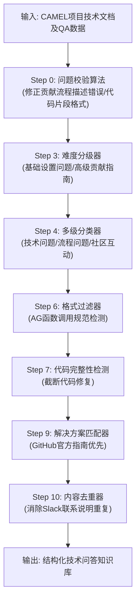

# DataFlowAgentBot


The DataFlowAgent is divided into two stages. In the first stage, it only functions as an intelligent chat assistant based on the user's knowledge base and does not need to complete the interactive DataFlow work.

---

**2025-4-9：**

- Recommendation for Strong Inference Pipelines - Refer to the **"Dataflow - Strong Inference Pipelines & Algorithms"** document.

```shell
服务启动之后：uvicorn main:app --reload

curl -X POST "http://localhost:8000/recommend" -H "Content-Type: application/json" -d '{
  "user_id": 123,
  "message": {"content": "这个知识库推荐的Pipeline是什么？？"},
  "model": "gpt-3.5-turbo",
  "kb_id": "1",
  "max_tokens":4000,
  "temperature": 1.0,
  "language":"Chinese" 
}'

```

Return result:

```json
{
  "mermaid": "flowchart TD\n A[输入: CAMEL项目技术文档及QA数据] --> B[Step 0: Question正确性Verify算法\n (修正贡献流程描述错误/代码片段格式)]\n B --> C[Step 3: Question难度分类\n (区分基础设置问题/高级贡献指南)]\n C --> D[Step 4: Question类别分类器\n (标记为技术问题/流程问题/社区互动)]\n D --> E[Step 6: 规则过滤(格式AG函数调用示例)]\n E --> F[Step 7: 规则过滤(截断代码过滤)]\n F --> G[Step 9: Answer筛选算法\n (匹配GitHub指南中的官方解决方案)]\n G --> H[Step 10: 规则过滤（去重）\n (去除重复的Slack联系方式说明)]\n H --> I[输出: 结构化技术问答知识库]",
  "analysis": {
    "数据处理依据": {
      "数据类型特征": [
        "技术文档与社区指南混合数据（含PDF/URL）",
        "包含代码片段和API调用示例",
        "存在多轮对话式QA结构",
        "涉及版本控制操作流程"
      ]
    },
    "质量需求": {
      "Step 0": "需要保证贡献流程描述的精确",
      "Step 3-4": "区分安装问题（易）与架构贡献问题（难），标注技术类别",
      "Step 6": "统一函数调用格式（如 similarity_threshold 数值类型校验）",
      "Step 7": "过滤不完整的 AutoRetriever 配置代码片段",
      "Step 9": "匹配官方指南中 'open issue' 的标准流程描述",
      "Step 10": "消除重复的 Slack/Discord 加入指引"
    },
    "流程优化建议": [
      "Step 6 增加 Markdown 语法验证子模块",
      "Step 9 集成 GitHub API 实时校验流程",
      "对代码片段建立 AST 语法树验证机制"
    ],
    "步骤说明": {
      "Step 0": "对问题正确性进行验证，修正贡献流程描述错误或代码片段格式",
      "Step 3": "对问题进行难度分类，区分基础设置问题和高级贡献指南",
      "Step 4": "将问题标记为技术问题、流程问题或社区互动问题",
      "Step 6": "进行规则过滤，例如统一代码示例缩进和API参数格式",
      "Step 7": "进行规则过滤，去除截断的 RAG 函数调用示例"
    }
  }
}
```




**Pending Updates:**

- There may be **syntax issues** in the output Graph TD. Since this is currently just a chat, code repair and verification cannot be performed (Phase 2).
- **`PromptsTemplate`** self-synthesis
- Interactive Data Synthesis Processing (Phase 2).

---

**2025-4-5：**

- Optimize the code structure;
- Improve the creation process of task workflows;
- Utilize `PromptsTemplateGenerator` to initialize and add new task templates as well as system templates;
- Enable setting language requirements for responses;

**Pending Updates:**

1. Pipeline recommendations;
2. **`PromptsTemplate`** self-synthesis

---
### Functions in the first stage:
1. Conduct intelligent Q&A regarding the user's knowledge base, which is not limited to:
   * How to fine-tune this knowledge base using a Large Language Model (LLM)?
   * How to optimize this knowledge base?
   * What are the structure, content, domain distribution, and the proportion of structured data in the knowledge base?
2. Quick call of the AgentAPI;

```python
启动服务：
uvicorn main:app --reload

API测试：
curl -X POST "http://localhost:8000/recommend" -H "Content-Type: application/json" -d '{
  "user_id": 123,
  "message": {"content": "这个知识库推荐的Pipeline是什么？？"},
  "model": "gpt-3.5-turbo",
  "kb_id": "1",
  "max_tokens":4000,
  "temperature": 1.0,
  "language":"Chinese" 
}'


curl -X POST "http://localhost:8000/analyze" -H "Content-Type: application/json" -d '{
  "user_id": 123,
  "message": {"content": "我想要微调这个知识库，我该如何做？？"},
  "model": "gpt-3.5-turbo",
  "kb_id": "1",
  "max_tokens":4000,
  "temperature": 1.0,
  "language":"Chinese" 
}'


```
3. Q&A about the local complete knowledge base or Q&A about the knowledge base summary report;
**ChatAgentYAML：**

```python
API_KEY: sk-ao5wGhCOAWidgaEK3WEcqWbk5a1KP8SSMsnOAy9IeRQNylVs
CHAT_API_URL: https://api.chatanywhere.com.cn/v1/chat/completions
MODEL: gpt-3.5-turbo
local: false #读入本地知识库还是获取知识库的摘要信息
TaskYaml: TaskInfo.yaml
```
**TaskInfo：**

```python
api_key: sk-ao5wGhCOAWidgaEK3WEcqWbk5a1KP8SSMsnOAy9IeRQNylVs
base_url: https://api.chatanywhere.com.cn/v1
modelname: gpt-3.5-turbo
tasktype: 0
```
4. Simple construction of Retrieval Augmented Generation (RAG);

**CamelRag：**

```python
api_key: sk-EeIRGDMK9OYGtsosbo9XWBg30CuW2SUltT8Zfy7Tw1Ow51Hi
kb_id: 2
output_path: ../data/knowledgebase/
#---------------------------------------------------------------构建RAG---------------------------------------------------------------
db_path: local_data
chunk_size: 50000
contents: ["https://www.zhihu.com/question/652674711/answer/3617998488",'https://mmssai.com/archives/30317']
collection_name: LearnRAG 
query: 什么是RAG？？
model_name: text-embedding-ada-002 #指定Embedding模型
path: local_data
```
Based on the content of the links (it can also be based on PDFs, TXTs, etc.) \["[https://www.zhihu.com/question/652674711/answer/3617998488](https://www.zhihu.com/question/652674711/answer/3617998488)", "[https://mmssai.com/archives/30317](https://mmssai.com/archives/30317)"\], construct:

```python
python AgentRole/Rag.py 
```
5. Customization of Agent tasks;
6. ......

---
### Functions in the second stage:
1. Combine with the full-link DataFlow Pipeline to achieve interactive data processing;
2. ......


---


